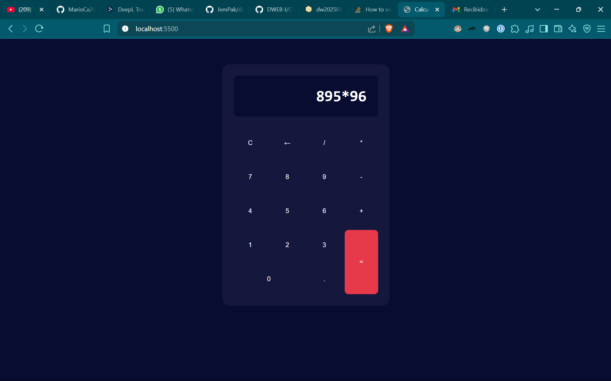
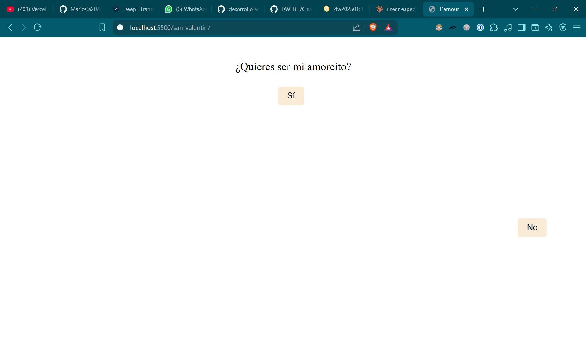

# 🎮 Colección de Juegos Web

Una colección de juegos interactivos construidos con HTML, CSS y JavaScript vanilla para aprender desarrollo web.

## 🌟 Juegos Incluidos

### 1. 🧮 Calculadora Web
Una calculadora simple y funcional construida con HTML, CSS y JavaScript vanilla.

### 2. 💕 L'amour - Juego del Amor
Un juego divertido e interactivo donde el botón "No" huye cada vez que intentas hacer click en él.

### 3. 🏓 Ping Pong
Un contador de puntos para partidas de ping pong con sistema de victoria personalizable.

## 📁 Demos

## 🚀 Realizado por

Juan José Monsalve Patiño
